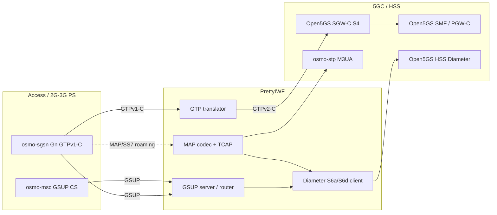

# PrettyIWF

**PrettyIWF** is a single-binary **Interworking Function (IWF)** for mobile core labs and integration. It bridges legacy **GTPv1-C (Gn)** and modern **GTPv2-C (S4/S11)**, and optionally **Osmocom GSUP/MAP** to **3GPP Diameter (S6a/S6d)** toward an **Open5GS**-style HSS/SMF stack.

User-plane GTP-U is **not** terminated here: the IWF is **control-plane only**. GTP-U flows directly between the radio access side and the SGW-U (e.g. Direct Tunnel).

## Features

| Feature | Build flag | Config | What it does |
|--------|------------|--------|----------------|
| **GTPv1 ⇄ GTPv2** | *(default)* | `[iwf]`, `[sgwc]`, `[smf]` | Translates osmo-sgsn Gn to Open5GS SGW-C S4: Create/Update/Delete PDP, Context Request, Modify Bearer after CSResp, PCO/DNS forwarding, duplicate (IMSI,APN) guard. |
| **MAP ⇄ Diameter S6d** | `MAP_IWF_ENABLED=1` | `[map_iwf]`, `[stp]`, `[diameter_s6d]` | Roaming MAP/Gr (SAI, UL, CL, PUR, ISD) over M3UA/SCCP to Diameter AIR/ULR/CLR/PUR toward HSS. |
| **GSUP HSS proxy** | `MAP_IWF_ENABLED=1` | `[gsup_server]`, `[roaming_hlr]` | osmo-sgsn / osmo-msc GSUP → local Diameter S6a/S6d (Open5GS HSS): auth, PS/CS UL, ISD with MSISDN + PDP/APN list. |
| **MAP SMS** | `+ SMS_IWF_ENABLED=1` | `[sms_iwf]`, `[gsup_client]`, `[smpp_server]` | Inbound MT / outbound MO SMS interworking (optional). |

See [iwf/README.md](iwf/README.md) for build, install, and operational detail.

Standards coverage audit (Open5GS, Kamailio, osmo-msc, IWF): [iwf/docs/standards-audit.md](iwf/docs/standards-audit.md).

## Architecture



### Where each feature sits

1. **GTP interworking** — Between **osmo-sgsn** and **Open5GS SGW-C**. The SGSN speaks GTPv1 on Gn; the SGW-C expects GTPv2 on S4. PrettyIWF rewrites messages, TEIDs, F-TEIDs (including SMF S5/S8-C), ULI from RAI, and session state so a single subscriber PDP context can be created on the 5GC side.

2. **GSUP → Diameter** — Between **Osmocom MSC/SGSN** and **Open5GS HSS**. Subscribers homed on your PLMN (`local_mnc`) get `LOCAL→Diameter`: SAI→AIR, UL→ULR (S6d for PS, S6a for CS), then ISD/UL_RES with MSISDN and per-APN PDP info parsed from the ULA. Roaming IMSIs can still be sent to a foreign HLR via MAP using `[roaming_hlr]`.

3. **MAP → Diameter** — For **roaming SGSNs** still using MAP/Gr over SS7. The IWF terminates TCAP, encodes/decodes MAP, and speaks Diameter to PyHSS/Open5GS on the other side.

### What this is good for

- **2G/3G PS core + 5GC user plane** without replacing the SGSN: keep osmo-sgsn on Gn, attach Open5GS SGW-C/SMF/SGW-U on S4/S5.
- **Osmocom HLR replacement**: point GSUP at PrettyIWF instead of osmo-hlr when the subscriber database lives in **Open5GS MongoDB**.
- **CS + PS on one HSS**: MSC and SGSN share the same Diameter ULR/ISD path with correct **CN domain** (CS vs PS) and MSISDN encoding for OsmoMSC.
- **Lab / CI**: small C binary, example `iwf.conf`, no GTP-U in the process — easy to tcpdump and reason about.

## Quick start

```bash
cd iwf
make
cp iwf.conf /etc/iwf/iwf.conf   # edit local_ip, sgwc, smf
./iwf -c /etc/iwf/iwf.conf
```

Full build with GSUP + MAP:

```bash
make MAP_IWF_ENABLED=1 SMS_IWF_ENABLED=1
```

## Repository layout

| Path | Purpose |
|------|---------|
| `iwf/` | Source, `iwf.conf` example, `README.md`, `setup-ubuntu.sh` |
| `LICENSE` | MIT-style permissive license (same as prior “bring your own” intent, now explicit) |

## Branches (feature history)

Development is organized into feature branches merged into `main`:

- `feature/gtpv1-gtpv2-interworking` — core GTP translator
- `feature/map-s6d-interworking` — MAP ↔ Diameter over STP
- `feature/gsup-hss-diameter-proxy` — GSUP server and Open5GS HSS path
- `feature/public-docs-and-config` — sanitized examples and GitHub docs

## License

See [LICENSE](LICENSE).

## Author

**Ahmad Raeiji** — [ahmad.rayeji@gmail.com](mailto:ahmad.rayeji@gmail.com)
