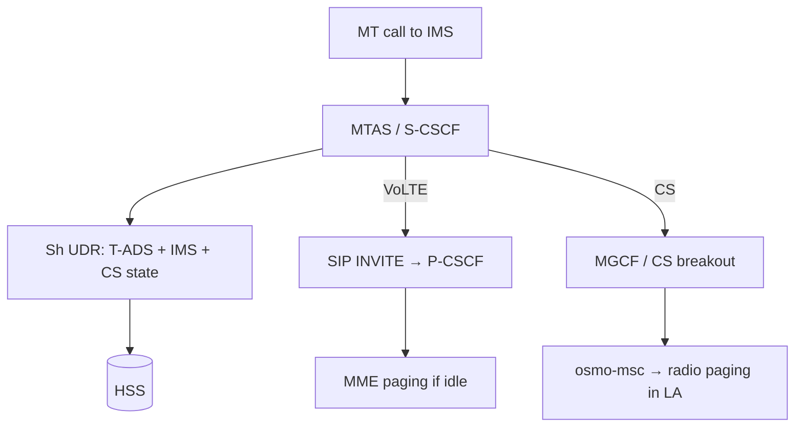

# Standards audit — CS + VoLTE lab stack

Audit scope: local repos under `c:\Users\ahmad\source\repos\`  
**IWF** · **open5gs** · **kamailio** · **osmo-msc**

Legend: **Y** implemented · **P** partial · **N** missing

---

## End-to-end MT voice (what 3GPP expects)



**Standard domain selection:** TS 23.292 **T-ADS** via **Sh** (TS 29.328).  
**Lab reality:** T-ADS chain is broken; use Kamailio policy or `term_reachability.cfg` (disabled by default).

---

## open5gs (`c:\Users\ahmad\source\repos\open5gs`)

### HSS — TS 29.272 (S6a)

| Feature | Status | Evidence |
|---------|--------|----------|
| AIR/AIA (E-UTRAN + UTRAN vectors) | **Y** | `src/hss/hss-s6a-path.c` — UTRAN-Vector for IWF |
| ULR/ULA + Subscription-Data | **P** | `hss_ogs_diam_s6a_ulr_cb` — only `SKIP_SUBSCRIBER_DATA` flag acted on |
| MSISDN / NAM / APN profile in ULA | **Y** | `hss_s6a_avp_add_subscription_data`, `lib/dbi/subscription.c` |
| PUR/PUA, CLR/CLA, IDR/IDA | **Y/P** | `hss-s6a-path.c`; IDR always `idr_flags=0` |
| ULR-Flags (S6a/S6d, GPRS-Sub, Initial-Attach) | **P** | Defined in `lib/diameter/s6a/message.h`; HSS ignores most bits |
| GPRS-Subscription-Data AVP | **N** | Dict only; not returned |
| CS / VLR registration | **N** | All ULR peers stored as `mme_host` (`hss_db_update_mme`) |
| T-ADS (IDR TADS + NOR + Sh PNR) | **N** | Constants only; MME never sends NOR; Sh is PS-only |

### HSS — Cx (TS 29.228) — Kamailio IMS

| Feature | Status | Evidence |
|---------|--------|----------|
| UAR/UAA, MAR/MAA, SAR/SAA, LIR/LIA | **Y** | `src/hss/hss-cx-path.c` |
| iFC from Mongo IMS profile | **Y** | `hss-context.c` |
| S-CSCF binding persistence | **P** | In-memory; lost on HSS restart |

### HSS — Sh (TS 29.328) — T-ADS inputs

| Feature | Status | Evidence |
|---------|--------|----------|
| UDR/UDA (PS user state, EPS location) | **P** | `src/hss/hss-sh-path.c` — data-refs 11,12,14,15 only |
| CS User State / VLRNumber / MSCNumber | **N** | Comment ~L169: *"Only PS domain supported (no CS/VLR)"* |
| SNR/PNR (reachability notify) | **P** | Triggered from NOR receive; no CS domain |

### MME — TS 23.401

| Feature | Status | Evidence |
|---------|--------|----------|
| Attach/TAU, S1AP, S11, bearers | **Y** | `src/mme/` |
| S6a client (AIR/ULR/PUR/CLR/IDR) | **Y** | `src/mme/mme-fd-path.c`, `mme-s6a-handler.c` |
| SGs → VLR (CSFB / SMSoS) | **P** | `src/mme/sgsap-path.c` — needs `csmap` + osmo-msc |
| Combined attach (NAM=0) | **P** | `mme-s6a-handler.c`, subscriber `network_access_mode` |
| SRVCC / ICS / NOR originator | **N** | ULR sets SRVCC not supported; no NOR TX |
| IDR T-ADS / UE reachability answer | **N** | `mme-fd-path.c` rejects non-EPS IDR flags |

### Missing for CS + VoLTE + IWF lab

1. **T-ADS end-to-end** (HSS ↔ MME ↔ IMS)
2. **Sh CS domain** (VLR/MSC number for Kamailio CS fallback)
3. **Separate CS node state** (IWF CS ULR still → `mme_host`)
4. **`network_access_mode: 0`** in Mongo for SGs combined attach
5. **IMS Cx subscriber profile** in Mongo for Kamailio registration

---

## kamailio (`c:\Users\ahmad\source\repos\kamailio`)

### IMS — TS 23.228 / TS 24.229

| Feature | Status | Evidence |
|---------|--------|----------|
| P-CSCF / I-CSCF / S-CSCF examples | **Y** | `misc/examples/ims/{pcscf,icscf,scscf}/` |
| REGISTER, `lookup("location")`, iFC/ISC | **Y** | `ims_registrar_scscf`, `ims_isc`, `ims_icscf` |
| Session timers | **Y** | `misc/examples/ims/session_timers.cfg` |
| Rx VoLTE bearers (QCI) | **Y** | `ims_qos` + P-CSCF mo/mt routes |
| Rf/Ro charging | **Y** | `ims_charging` |

### Diameter — Cx / Sh

| Feature | Status | Evidence |
|---------|--------|----------|
| Cx MAR/SAR/UAR/LIR | **Y** | `cdp/diameter_ims.h`, `ims_auth`, `ims_icscf`, `ims_registrar_scscf` |
| Sh UDR/SNR/PNR (T-ADS) | **P** | `misc/examples/ims/scscf/route/term_reachability.cfg` — **off by default** |
| Sh in core modules | **P** | `ims_diameter_server`; not wired except T-ADS example |

### CS / VoLTE interworking

| Feature | Status | Evidence |
|---------|--------|----------|
| T-ADS / CS fallback script | **P** | `term_reachability.cfg`, `docs/terminating-volte-reachability.md` |
| MGCF (IMS ↔ CS) | **N** | `route[PSTN]` → generic `dispatcher`; no ISUP/osmo-msc |
| MTAS (MMTel AS) | **N** | External AS via `ims_isc` only |
| VLR-aware routing to osmo-msc | **N** | `VLRNumber` from Sh logged but not used for MSC select |
| MAP / SGs / Sv to osmo-msc | **N** | Not in Kamailio; belongs in IWF/MGCF/MNCC layer |

### Missing for CS + VoLTE + osmo-msc

1. Enable + complete **T-ADS** against Open5GS Sh (needs HSS CS Sh support)
2. **MGCF** or explicit SIP trunk to osmo-msc **MNCC** (not generic PSTN dispatcher)
3. **MTAS** for terminating supplementary services
4. Policy when Sh unavailable: SIP reg → VoLTE; else → MSC

---

## osmo-msc (`c:\Users\ahmad\source\repos\osmo-msc`)

### CS — TS 23.012 / TS 24.008

| Feature | Status | Evidence |
|---------|--------|----------|
| Location Update FSM | **Y** | `src/libvlr/vlr_lu_fsm.c` |
| Authenticate / access / detach | **Y** | `vlr_auth_fsm.c`, `vlr_access_req_fsm.c`, `vlr.c` |
| MM/CC (LU, CM Service, setup, release) | **Y** | `src/libmsc/gsm_04_08.c`, `gsm_04_08_cc.c` |
| CS paging (A / Iu / SGs) | **Y** | `src/libmsc/paging.c`, `sgs_iface.c` |
| MM timers (T3212 etc.) | **Y** | `vlr.c` `msc_tdefs_vlr[]` |

### GSUP (Osmocom — toward IWF / osmo-hlr)

| Feature | Status | Evidence |
|---------|--------|----------|
| CN_DOMAIN=CS on UL/SAI | **Y** | `src/libvlr/vlr.c` |
| UL req/res/err | **Y** | `vlr_subscr_req_lu()`, `vlr_subscr_handle_lu_*()` |
| ISD req → MSISDN in VLR | **Y** | `vlr_subscr_gsup_insert_data()` — gsm48 BCD decode |
| SAI, cancel, check IMEI | **Y** | `vlr.c`, `vlr_auth_fsm.c` |
| SMS MO/MT over GSUP | **Y** | `src/libmsc/gsm_04_11_gsup.c` |
| PURGE_MS RX, DELETE_DATA | **N/P** | `out_unimpl` in `vlr_gsup_rx()` |
| GSUP paging | **N** | Paging is RAN-local only |

### IMS / VoLTE / T-ADS

| Feature | Status | Evidence |
|---------|--------|----------|
| Native MAP HLR | **N** | GSUP only; docs point to MAP proxy |
| IMS / VoLTE | **N** | No SIP stack in-tree |
| T-ADS | **N** | HSS/IMS responsibility |
| MNCC → external SIP | **P** | `mncc_sock.c`, `sdp_msg.c` — use osmo-sip-connector |
| SGs CSFB (LTE→CS) | **Y** | `sgs_iface.c`, `doc/manuals/chapters/sgs.adoc` |

### Missing for CS + VoLTE lab

1. **IWF/PrettyIWF** as GSUP HLR (not osmo-hlr) — requires correct **ISD MSISDN** encoding
2. **MNCC/SIP bridge** to Kamailio for CS MT calls
3. **SGs to Open5GS MME** if LTE CSFB desired (separate from pure 3G attach)
4. HSS **Sh CS state** if Kamailio T-ADS should prefer CS domain

---

## PrettyIWF (`c:\Users\ahmad\source\repos\IWF`)

| Feature | Status | Evidence |
|---------|--------|----------|
| GSUP SAI/UL/ISD/LOC-CANCEL | **Y** | `gsup_map_proxy.c`, `gsup_proto.c` |
| CS ISD MSISDN (gsm48 BCD) | **Y** | `gsup_enc_bcd_digits_gsm48()` in `gsup_proto.c` |
| CS mandatory ISD before UL_RES | **Y** | `map_iwf_on_ula()` |
| S6d ULR PS (GPRS-Sub, no MME bit) | **Y** | `diameter_send_ulr()` — TS 29.272 §7.3.7 |
| CS ULR (flags=0, UTRAN RAT) | **Y** | `diameter.c` |
| Separate `origin_host_cs` | **Y** | `[diameter_s6d]` in `config.c` |
| HSS CLR → GSUP CS+PS fan-out | **Y** | `gsup_map_proxy_hss_clr()` |
| MAP SAI/UL/CL/PUR/ISD (STP) | **Y** | `map_iwf.c` |
| GTPv1↔GTPv2 (Gn↔S4) | **Y** | `gtpv1.c`, `gtpv2.c`, `translate.c` |
| Sh / T-ADS / Cx | **N** | Out of scope |
| GSUP PURGE from MSC | **N** | MAP PUR only |
| IDR/IDA as Diameter client | **N** | HSS-initiated only |

---

## Cross-component gaps (priority)

| # | Gap | Blocks | Owner |
|---|-----|--------|-------|
| 1 | **T-ADS (Sh)** | Standard MT VoLTE vs CS choice | Open5GS HSS + Kamailio `term_reachability.cfg` |
| 2 | **Sh CS user state** | Kamailio CS fallback with VLR awareness | Open5GS `hss-sh-path.c` |
| 3 | **MGCF / MNCC bridge** | IMS MT call → osmo-msc paging | Kamailio `route[PSTN]` → osmo-sip-connector → MNCC |
| 4 | **HSS `mme_host` for CS ULR** | Dual LTE+CS same IMSI conflicts | Open5GS or separate `origin_host_cs` on IWF |
| 5 | **Mongo `msisdn[]`** | CS VLR MSISDN empty | Open5GS subscriber DB |
| 6 | **IMS Cx profile** | Kamailio VoLTE REGISTER | Open5GS Mongo IMS + Kamailio Cx peer |
| 7 | **SGs MME↔MSC** | LTE CSFB voice | Open5GS MME `csmap` + osmo-msc SGs |

---

## Recommended lab routing (without T-ADS)

Until gap #1 is fixed:

```
MT INVITE → Kamailio S-CSCF
  ├─ lookup("location") hit  → SIP to UE (VoLTE path, MME paging via bearers)
  └─ miss                    → dispatcher/MNCC → osmo-msc → CS paging in LA
```

IWF role: keep **CS LU + ISD(MSISDN)** working; use **`origin_host_cs`** so HSS registration is distinguishable from PS/SGSN.

---

## IWF config reference

```ini
[diameter_s6d]
origin_host    = iwf-sgsn.mnc012.mcc432.3gppnetwork.org
origin_host_cs = iwf-vlr.mnc012.mcc432.3gppnetwork.org
origin_realm   = mnc012.mcc432.3gppnetwork.org
```

Expected logs:

```
# CS (osmo-msc)
TX ULR imsi=... cn=CS/S6d flags=0x0 rat=1000 origin=iwf-vlr...
TX ISD_REQ imsi=... msisdn=989... cn=CS

# PS (osmo-sgsn)
TX ULR imsi=... cn=PS/S6d flags=0x8 rat=1000 origin=iwf-sgsn...
```

---

## Repo paths

| Component | Local path |
|-----------|------------|
| PrettyIWF | `c:\Users\ahmad\source\repos\IWF` |
| Open5GS | `c:\Users\ahmad\source\repos\open5gs` |
| Kamailio | `c:\Users\ahmad\source\repos\kamailio` |
| osmo-msc | `c:\Users\ahmad\source\repos\osmo-msc` |
